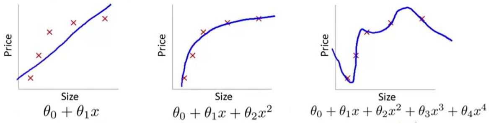
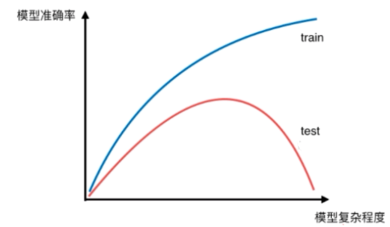
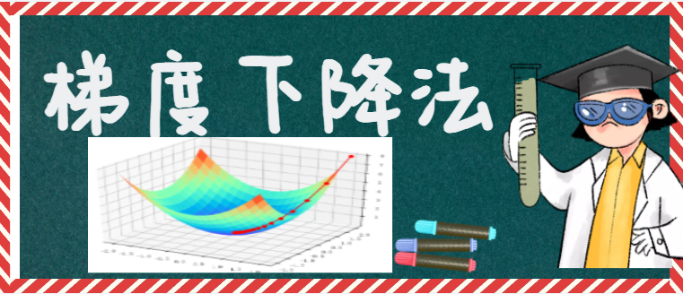
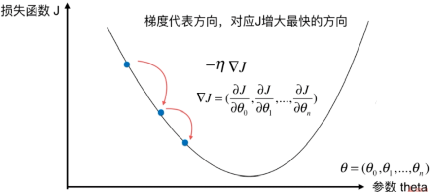

## 人工智能、机器学习、深度学习

## 线性回归基础

#### 什么是线性回归

​       举个例子，我们去市场买牛肉，一斤牛肉52块钱，两斤牛肉104块钱，三斤牛肉156块钱，以此类推。也就是说牛肉的价格随着牛肉斤数的增加而有规律地增加，这种规律可以用下图表示：

​       

​       可以看到上述规律可以用一条直线来表述，这就是一个线性模型。用 x表示牛肉斤数，

用 y 表示价格，就得到方程： y=52x

​      这个方程就叫做回归方程，52叫做回归系数，求解回归系数的过程叫做回归。

​      线性回归首先假设自变量和因变量是线性关系，然后通过对现有样本进行回归，进而计算出回归系数以确定线性模型，最后使用这个模型对未知样本进行预测

- 一元线性回归模型：f(x)=wx+b
- 多元线性回归模型：f(x)=w1 x1+w2 x2+…+wn xn+b

#### 线性回归的衡量指标

- MSE(Mean Squared Error):均方误差

$$
\Large \frac{1}{m}\sum_{i=1}^m(y^{(i)}-\hat{y}^{(i)})^2
$$

- RMSE(Root Mean Squared Error):均方根误差

$$
\Large \sqrt{\frac{1}{m}\sum_{i=1}^m(y^{(i)}-\hat{y}^{(i)})^2}
$$

- R方指标(R Squared)
  $$
  \Large R^2= 1 - \frac{MSE(\hat{y},y)}{var{(y)}}
  $$
  ​     

  - R2  <=  1
  - R2越大越好。当预测模型没有任何错误时,R2等于1
  - 引入R2衡量指标的原因：可以对不同回归问题的模型准确度进行统一衡量(例如：房价线性回归问题和学生成绩线性回归问题)

> **注意：**
>
> 在训练集中，也可以把MSE作为线性回归的损失函数，通过对损失函数最小化，从而得到线性回归对应的参数。

## 过拟合与欠拟合

#### 什么是过拟合、欠拟合

- 过拟合：算法所训练的模型过多地表达了数据的噪音
- 欠拟合：算法所训练的模型不能完整表述数据关系

> **注意： **
>
> 过拟合在训练集上表现良好，但在测试集上却表现较差

 

## 梯度下降法介绍

​    

#### 什么是梯度下降法

​        在机器学习中，对于很多监督学习模型，需要对原始的模型构建损失函数 J，接下来便是通过优化算法对损失函数J进行优化，最小化损失函数，以便寻找到最优的参数theta.于是，基于搜索的梯度下降法就产生了。

​     梯度下降法的含义是通过当前点的梯度（偏导数）的反方向寻找到新的迭代点，并从当前点移动到新的迭代点继续寻找新的迭代点，直到找到最优解。

#### 梯度下降法参数更新

$$
\Large \theta_j:=\theta_j-\alpha\frac{\partial}{\partial\theta_j}J(\theta)
$$

其中：α是学习率，偏导是梯度

> **两个小概念**：
>
> - 轮次：epoch,训练数据集学习的轮数
> - 批次：batch,如果训练数据集较大，一轮要学习太多数据，那就把一轮次要学习的   数据分成多个批次，一批一批数据地学习

#### 梯度下降法的改进版本

​        在超大的训练数据集中，使用传统的梯度下降法训练数据会出现损失函数的值在纵轴上有明显的频繁摆动的现象，我们希望算法在纵轴上不要这么频繁地摆动，但在横轴上，我们希望加快学习率，使算法能够更快地收敛到极小值。

​        于是，针对传统的梯度下降法，通过对历史梯度和当前梯度进行加权的方式进行改进，先后出现了很多梯度下降法的改进算法，目前在深度学习中最常用的梯度下降法改进算法是自适应矩估计算法Adam。

