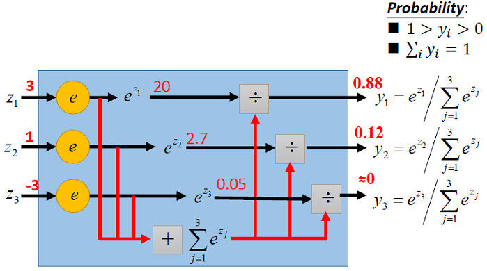

## 逻辑回归概述

#### 逻辑回归的作用

​      逻辑回归又称Logistic Regression（逻辑斯蒂回归），是一种广义的线性回归分析模型，常用于数据挖掘、疾病自动诊断、经济预测等领域。逻辑回归从本质来说用来解决二分类问题，但也可以使用逻辑回归解决多分类问题（其实质还是通过二分类的思想解决的多分类）。

​      二分类问题是指预测的y值只有两个取值（0或1）。例如：一个垃圾邮件过滤系统，x是邮件的特征，预测的y值就是邮件的类别（是垃圾邮件还是正常邮件）。

#### 逻辑回归的假设函数

逻辑回归是将样本的特征和样本分类的概率联系起来

先来看Sigmoid函数：
$$
\Large g(z)=\frac{1}{1+e^{-z}}
$$
Sigmoid函数图像为：

逻辑回归的假设函数是：
$$
\Large h_\theta(x)=\frac{1}{1+e^{-\theta^Tx}}
$$
 假设函数的理解：

- θTx其实就是线性模型
- 将线性模型的结果交给sigmoid函数处理，即为逻辑回归的假设函数
- 该假设函数预测的是分类y=1的发生概率的大小

#### 逻辑回归的损失函数

二元逻辑回归交叉熵损失函数：

推导过程：（了解即可）

#### 逻辑回归解决多分类问题

## Softmax回归

#### 什么是Softmax回归

- Softmax回归模型是逻辑回归模型在多分类问题上的推广

- Softmax回归使用的是softmax函数

  

#### Softmax激活函数

$$
\Large p_l=\frac{e^{z_l}}{\sum_{j=1}^ke^{z_j}}
$$

由上式可以看出：softmax函数可以巧妙地将多个分类的分数（zl）转化为(0,1)的值并且和为1。softmax函数计算的结果是各个分类的预测概率值。
